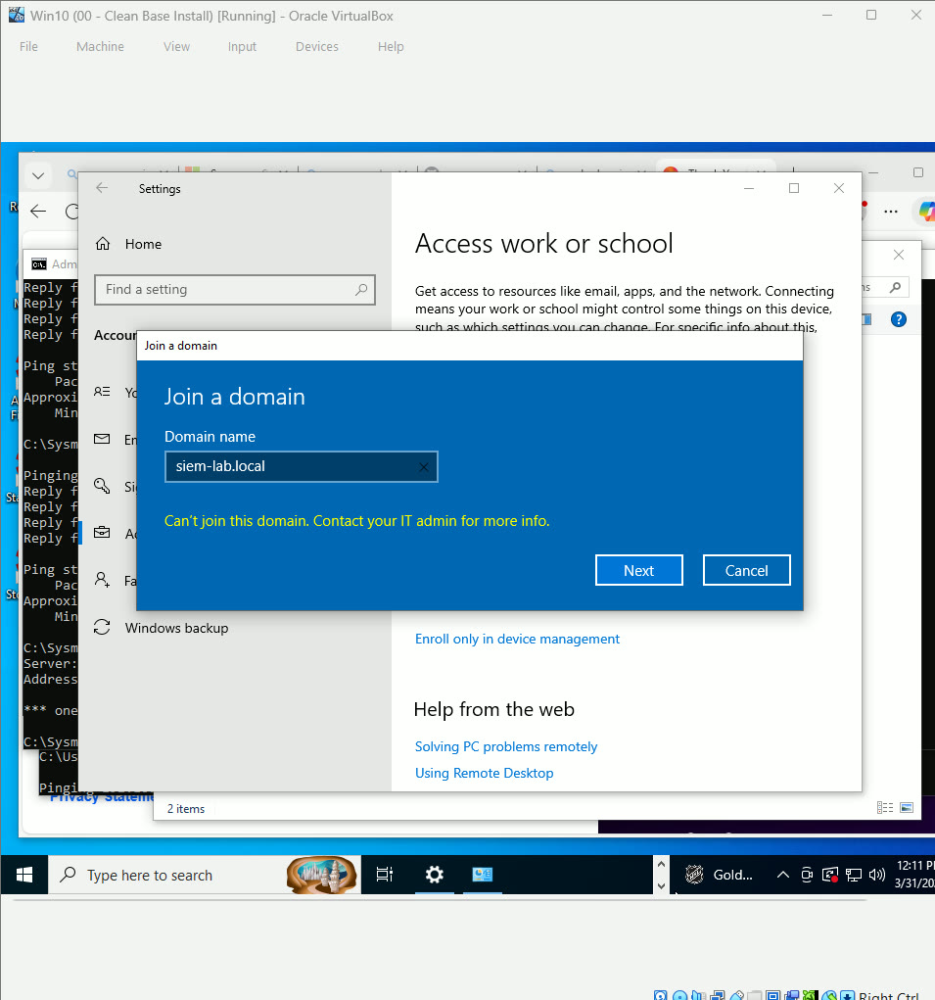
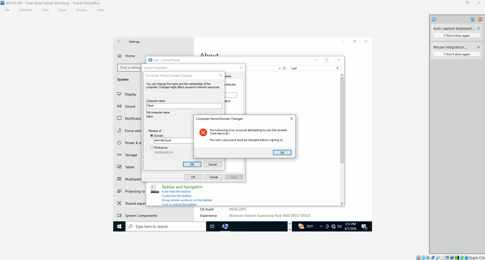
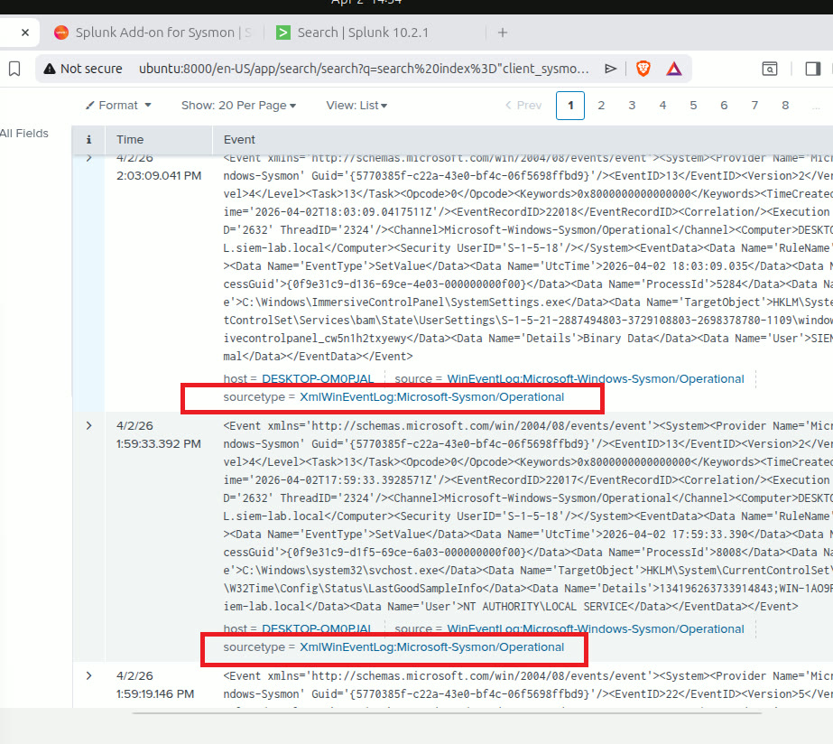
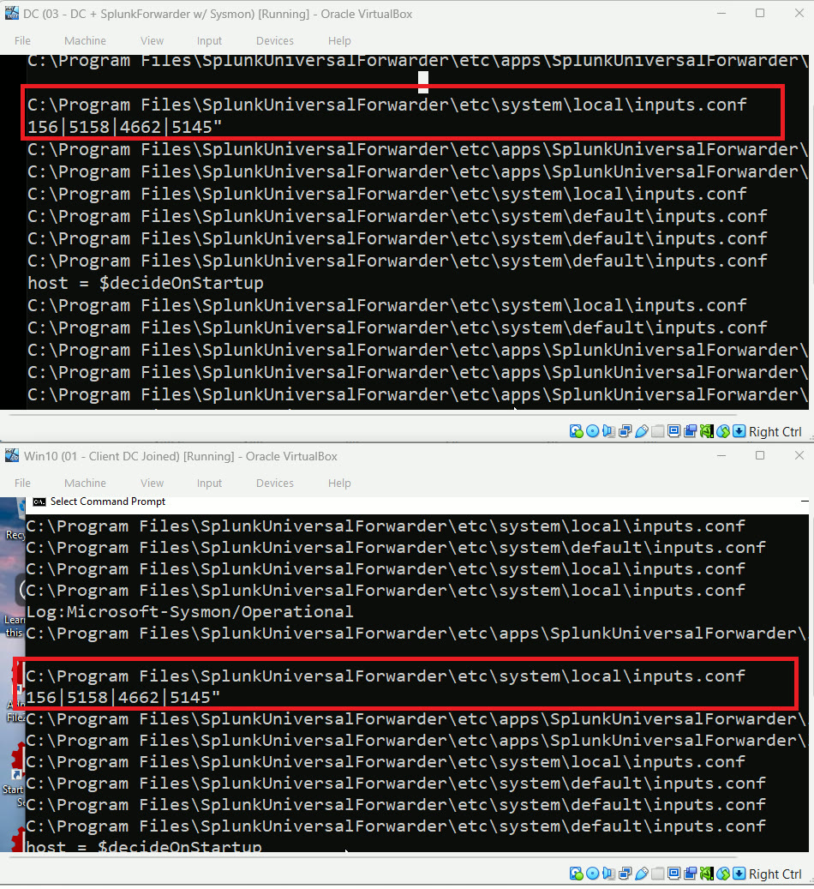
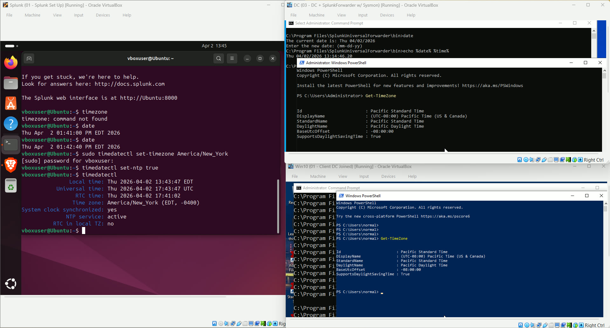
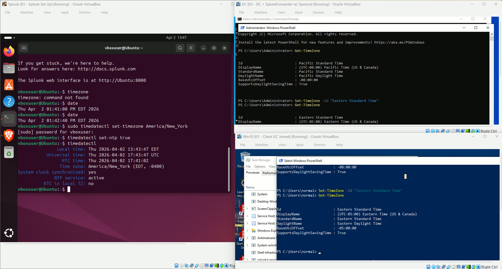

# Challenges & Lessons Learned

## Client Machine Failed to Join Domain
 
 
My client user wasn't able to connect to the domain controller with the correct log in. And the prompt gave zero clue as to why.

Learned that the control panel version of troubleshooting is different from window's settings and usually provides better error messages for an apt solution. 
## Splunk Input.conf

The logs were not in CIM compliance and the source type wasn't what I set in the input.conf

Learned a more modern approach to creating the input.conf from splunk documentation.

## Time Sync Issues

The server times were not only in different time zones but the DC server was drifting up and down in time. This caused splunk to recieve and document logs in incorrect times.

Learned how to sync time between linux and window's machines with commandlines.
