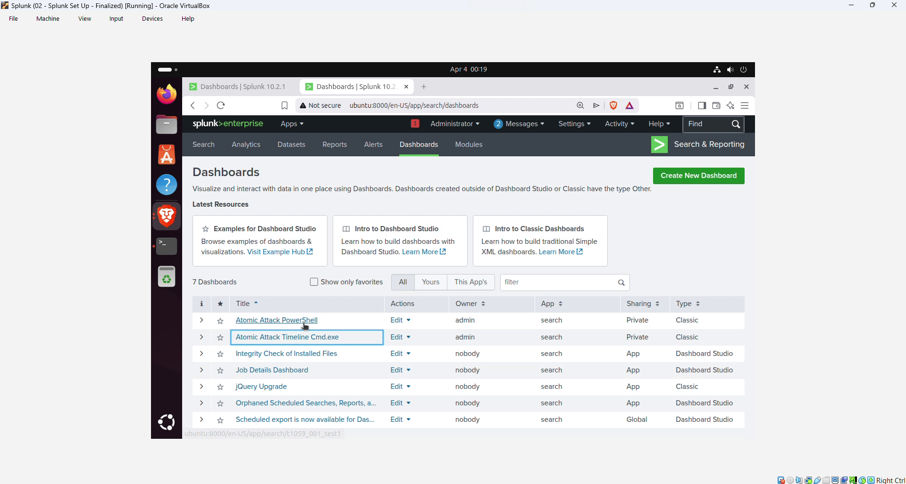

# Splunk SIEM Home Lab – Detection Engineering with Atomic Red Team

This project demonstrates practical **detection engineering** in a Windows Active Directory environment. I built a small security lab to simulate real adversary behavior using Atomic Red Team and detect it using Splunk SIEM and Sysmon.

## Lab Architecture
- **Windows Server 2022** – Domain Controller + Splunk Universal Forwarder + Sysmon (Olaf Hartong config)
- **Windows 10** – Domain-joined client + Splunk Universal Forwarder + Sysmon
- **Splunk Enterprise** – Central SIEM with custom indexes and CIM-compliant parsing

## Techniques Simulated (MITRE ATT&CK)
- **T1059.003** – Command and Scripting Interpreter (Windows Command Shell)
- **T1059.001** – PowerShell Execution (basic and download/execute variants)
- **T1562.001** – Impair Defenses (attempt to disable Windows Defender)

## Key Achievements
- Configured domain environment with proper logging infrastructure
- Ingested high-fidelity Sysmon logs into Splunk
- Built and tuned detections for suspicious execution techniques
- Created a custom dashboard to visualize attack activity
- Documented troubleshooting process (time sync, Defender alerts, domain join issues, etc.)

## Demo 
  

## Dashboard
  
  

## Challenges & Lessons Learned
- Overcame time synchronization issues between Windows and Linux
- Handled Windows Defender false positives during Atomic Red Team installation
- Fixed inconsistent sourcetypes and inputs.conf parsing
- Resolved domain join DNS and network profile problems

## Technologies Used
Splunk Enterprise, Sysmon (Olaf Hartong), Atomic Red Team, MITRE ATT&CK, Windows Event Logs, CIM-compliant logging
